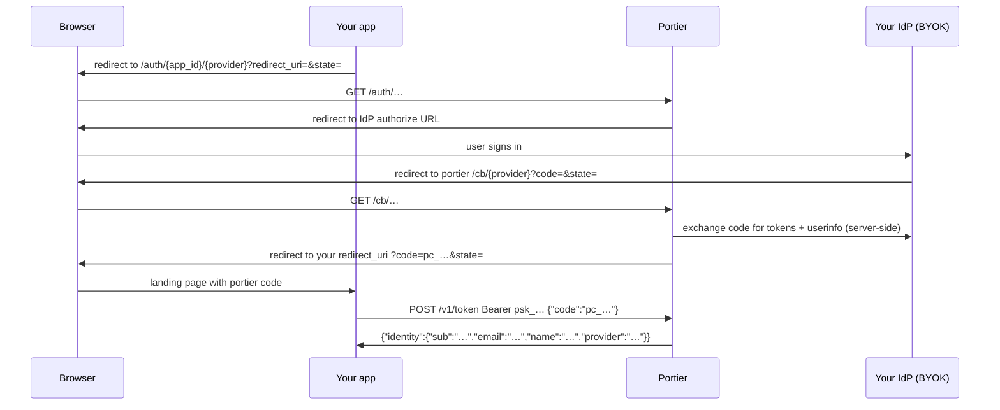

# portier integration guide — OIDC, BYOK, pay-per-auth

For **agents** automating setup and **SMEs** wiring SSO without reading the source.
Machine-readable contract: [`/llms.txt`](https://portier.intrane.fr/llms.txt) · JSON: [`/guide`](https://portier.intrane.fr/guide).

## What portier does (and does not do)

| portier handles | You bring (BYOK) |
|-----------------|------------------|
| OAuth/OIDC authorization-code dance with the IdP | IdP OAuth app (`client_id` + `client_secret`) |
| HMAC-signed login state (CSRF + tamper-proof) | Your app's `redirect_uri` list |
| One-time portier code → verified identity exchange | Peage wallet token (`pw_…`) past the free tier |
| Per-auth metering via peage | — |

**BYOK (Bring Your Own Key)** means you register an OAuth/OIDC application at your identity
provider (GitHub, Google, Keycloak, Auth0, machin-idp, …) and give portier the credentials.
portier never hosts a shared IdP — each relying app uses its own IdP client.

portier is **not** a user directory. After login you receive a verified identity
(`sub`, `email`, `name`, `provider`) and manage sessions yourself.

## Three-step setup

```sh
# 1. Register (secret shown once)
curl -s -X POST https://portier.intrane.fr/v1/apps \
  -d '{"name":"my app","redirect_uris":"https://myapp.com/auth/done"}'
# -> {"app_id":"app_…","app_secret":"psk_…"}

# 2. Add a provider (BYOK — see table below)
curl -s -X POST https://portier.intrane.fr/v1/apps/provider \
  -H 'Authorization: Bearer psk_…' \
  -d '{"kind":"github","client_id":"…","client_secret":"…"}'

# 3. Set billing wallet (required once free tier is exhausted)
curl -s -X POST https://portier.intrane.fr/v1/apps/wallet \
  -H 'Authorization: Bearer psk_…' \
  -d '{"wallet_token":"pw_…"}'
```

Check status anytime: `GET /v1/apps/me` with `Authorization: Bearer psk_…` returns
`auth_count`, `free_remaining`, `billing`, `blocks_charged`, and configured providers.

## Login flow (authorization-code)



**Key points for implementers:**

- Send users to `https://portier.intrane.fr/auth/<app_id>/<provider>?redirect_uri=<registered>&state=<csrf>`.
- `redirect_uri` must **exactly** match a URL registered at app creation (open-redirect guard).
- `state` is your CSRF nonce; portier echoes it on the final redirect.
- The browser receives only a **portier code** (`pc_…`), never the identity. Exchange it
  **server-side** with your app secret — the code is one-time and short-lived.
- Signed portier state binds `app_id`, `provider`, `redirect_uri`, and expiry. The IdP callback
  path `/cb/<provider>` must match the provider name in that state.

## BYOK — configuring providers

Register this **IdP callback URL** at your OAuth/OIDC app (replace `{provider}` with the name
you chose in `POST /v1/apps/provider`):

```
https://portier.intrane.fr/cb/{provider}
```

The API response includes `idp_redirect_uri` and `login_url` for copy-paste.

### Presets (endpoints built in)

| `kind` | IdP console | Callback path | Notes |
|--------|-------------|---------------|-------|
| `github` | [GitHub OAuth apps](https://github.com/settings/developers) | `/cb/github` (or your custom `name`) | Scopes: `read:user user:email` |
| `google` | Google Cloud Console → OAuth client | `/cb/google` | Scopes: `openid email profile` |
| `intrane` | [machin-idp](https://github.com/javimosch/machin-idp) (self-host; [docs](https://javimosch.github.io/machin-idp/)) | `/cb/intrane` | Operator preset for a private machin-idp — not a public hosted IdP |
| `demo` | none | `/cb/demo` | No real IdP — curl-test the full flow |

Example GitHub:

```sh
curl -s -X POST https://portier.intrane.fr/v1/apps/provider \
  -H 'Authorization: Bearer psk_…' \
  -d '{"kind":"github","client_id":"Ov23…","client_secret":"…"}'
```

### Generic OIDC (`kind: oidc`)

For Keycloak, Auth0, Okta, GitLab, or any OIDC provider, supply endpoint URLs from the IdP's
`.well-known/openid-configuration`:

```sh
curl -s -X POST https://portier.intrane.fr/v1/apps/provider \
  -H 'Authorization: Bearer psk_…' \
  -d '{
    "name": "corp",
    "kind": "oidc",
    "client_id": "…",
    "client_secret": "…",
    "authorize_url": "https://idp.example.com/authorize",
    "token_url": "https://idp.example.com/token",
    "userinfo_url": "https://idp.example.com/userinfo",
    "scope": "openid email profile"
  }'
```

`authorize_url`, `token_url`, and `userinfo_url` are required. `scope` defaults to
`openid email profile` if omitted. Callback: `https://portier.intrane.fr/cb/corp`.

**v1 = OIDC/OAuth only.** SAML is on the roadmap ([machin#484](https://github.com/javimosch/machin/issues/484))
— it needs RSA/XML-DSig the pure-MFL runtime lacks.

## Pay-per-auth billing (peage)

No per-seat SSO subscription. Metering is per **successful** authentication:

| | Default |
|---|---------|
| Free tier | 100 auths |
| After free tier | 1 EUR per 100 auths (one "block") |
| Payment rail | [peage](https://peage.intrane.fr) wallet (`pw_…` token) |

### How charges work

1. After a successful IdP login (valid `sub` in userinfo), portier increments `auth_count`.
2. Once `auth_count` exceeds the free tier, portier POSTs to peage `/v1/charge` with
   idempotency key `app_id:block:N` (N = 1-based block number).
3. A charge succeeds only on **HTTP 200** with a non-empty JSON body and `ok:1`, `ok:"1"`, or
   `ok:true`. Anything else (402, 5xx, empty body, `ok:0`, missing `ok`) sets `billing=past_due`.
4. Multi-block catch-up runs on the next successful auth (max **20 blocks** per callback).
   Catch-up **stops on the first declined block** — already-billed blocks stay charged.

### What billing does *not* block

| Situation | Blocks in-flight login? | Blocks new `/auth`? |
|-----------|-------------------------|---------------------|
| Charge fails mid-login | No — user still gets their code | — |
| `past_due` + still within free tier | No | No |
| `past_due` + free tier exhausted | No (in-flight completes) | **Yes** — fund wallet |
| IdP token/userinfo exchange fails | N/A (not metered) | No |
| Empty/missing `sub` in userinfo | N/A (not metered) | No |

Fund or refresh the wallet:

```sh
curl -s -X POST https://portier.intrane.fr/v1/apps/wallet \
  -H 'Authorization: Bearer psk_…' \
  -d '{"wallet_token":"pw_…"}'
```

This clears `past_due`. Need a peage wallet? See [peage docs](https://peage.intrane.fr/llms.txt).

Tune defaults with env vars `PORTIER_FREE_AUTHS` (100) and `PORTIER_BLOCK` (100 auths per EUR).

## SME troubleshooting

| Symptom | Likely cause | Fix |
|---------|--------------|-----|
| "redirect_uri is not registered" | URL mismatch (trailing slash, http vs https) | Re-register exact URL in `redirect_uris` |
| "billing wallet is empty" | `past_due` after free tier | `POST /v1/apps/wallet` with funded `pw_` token |
| `/cb` returns 400 "IdP exchange" | Wrong client secret or token URL | Verify BYOK credentials and OIDC endpoints |
| `/cb` returns 400 "user identifier (sub)" | IdP userinfo missing `sub` | Fix IdP scopes/claims |
| Login works but `blocks_charged` lags | Catch-up after outage | Fund wallet; next auth bills owed blocks (max 20/callback) |
| `429 too many apps` | Rate limit | Wait — 10 registrations/hour/IP |

Operator runbook (dk1 deploy, peage env vars): [deploy.md](./deploy.md).

## Agent quick reference

| Resource | URL |
|----------|-----|
| Text contract | `GET /llms.txt` |
| JSON schema-ish guide | `GET /guide` |
| Health | `GET /_health` |
| App status | `GET /v1/apps/me` Bearer `psk_…` |

Security invariants agents should not regress: HMAC state, exact `redirect_uri` match,
state/provider binding on `/cb`, one-time portier codes, identities never in browser URL,
IdP exchange failures and empty `sub` are not metered.
